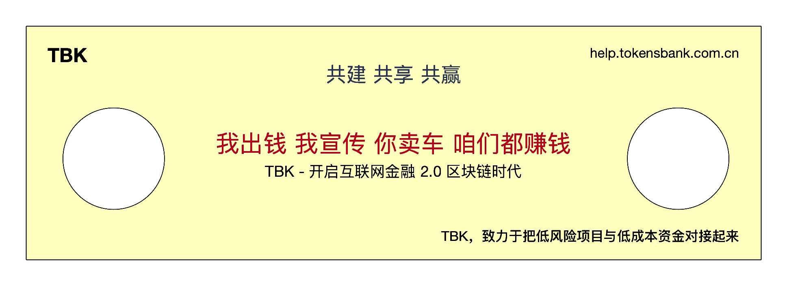

# 核心概念：共建共享，把风险关进笼子里

### TBK，是全新形态的互联网P2P金融服务平台。

基于区块链技术，采取公开透明的商业策略，彻底清除了暗箱操作，根本上保障了投资者的合法权益。

### TBK 与传统P2P金融的本质不同：

对于风控的态度是TBK成为P2P互联网金融2.0的根本理由。采用先进技术和理念，让可控的项目能够对接低风险喜好的投资者，降低了企业的融资成本，也降低了投资者的不必要的风险，为广大中小投资者开辟了一个低风险投资的通道。

### TBK 的主要服务对象：

愿意合法经营，努力壮大的广大中小企业。我们与您一道保护投资者对中小企业的信心。

### TBK 的主要项目范围：

初期主要面向贸易金融，选择易变现、可控制、物权清晰的流通物资进行质押融资服务。

