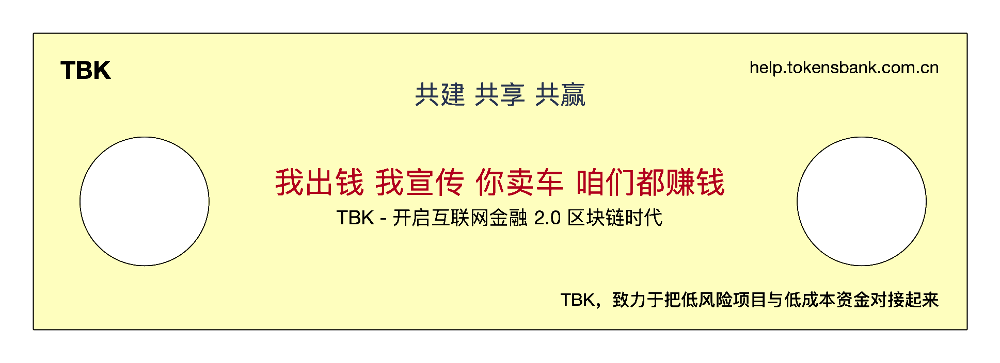

# 我与你之间的关系

### 如果你是金融服务公司

1. 我们为你提供覆盖全国的监管网络。
2. 你还可以发单到TBK，分散手中的项目风险。

### 如果你是进口代理公司

1. 我们可以为你提供覆盖全国的监管网络。
2. 通过我们的助销网络推进你的质押货物的销售，减小可能的风险。

### 如果你是贸易公司

1. 我们可以向你提供更多的融资来源。
2. 通过TBK的金融服务体系，你可以实现全国范围内不赎单调拨服务。
3. 通过TBK的助销系统，快于对手完成销售回款。

### 如果你是仓储公司

1. 你可以接入到TBK系统中，简化与你的合作伙伴之间的业务流程中。
2. 你管理的监管货物不用再担心物权的登记错误。物权将全部在链上准确记录。

### 如果你是物流运输公司

你只需接入TBK系统，就可以承接来自TBK平台的监管货物运输业务。

### 如果你是保险公司

与TBK系统平台对接，对于仓储、运输过程中的货物进行保险，能够追踪到货物的当前在库在途的状态，为客户提高购买保险和进行理赔的效率。

### 如果你是银行

是的，你可以进一步降低风险了。

