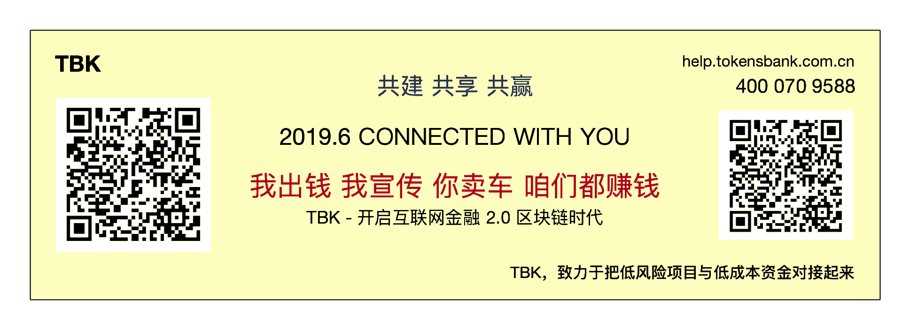

# 项目术语解释

### 以下为在本项目中出现的术语解释，提前了解，有利于理解本项目所描述的商业模式和各种业务流程。

1. ERP
2. 区块链
3. 物权：在TBK系统中，物权是由所有权和控制权组成的，缺少任何一个都是不能对货物进行处置的。例如，不能发起出库操作。
4. 物权所有权：是指物权的所有者，通常说的货主。货主拥有物权的所有权。当销售、风险处置时，会触发所有权的转移。拥有所有权而没有控制权是不能提取和最终处置货物的。
5. 物权控制权：是指物权的临时拥有权力。通常指抵押场景下的物权限制。拥有物权控制权而没有所有权是不能提取并最终处置货物的。
6. 物权监管：是指第三方机构对货物进行控制的行为。这在本质上属于数字化仓单管理机制。物权监管人不会接收到来自非完整物权人的提货请求的。这保障了监管的物权清晰、交易的高效。
7. 位置：是指货物的在库在途状态。通常是指库位。表明了当前监管货物所在的位置，并对当前位置做出评估，确认是否符合合约的约定。
8. 自动拍卖：是一旦出现融资人违约，对抵押货物的唯一处置方式。通过公开的在线拍卖，迅速完成对违约抵押物的处置变现，保护投资人的合法权益。
9. 监管内调拨指令
10. 计费
11. 结算
12. 风险
13. 保证金
14. 自动拍卖：是一旦出现融资人违约，对抵押货物的唯一处置方式。通过公开的在线拍卖，迅速完成对违约抵押物的处置变现，保护投资人的合法权益。
15. 智能合约

