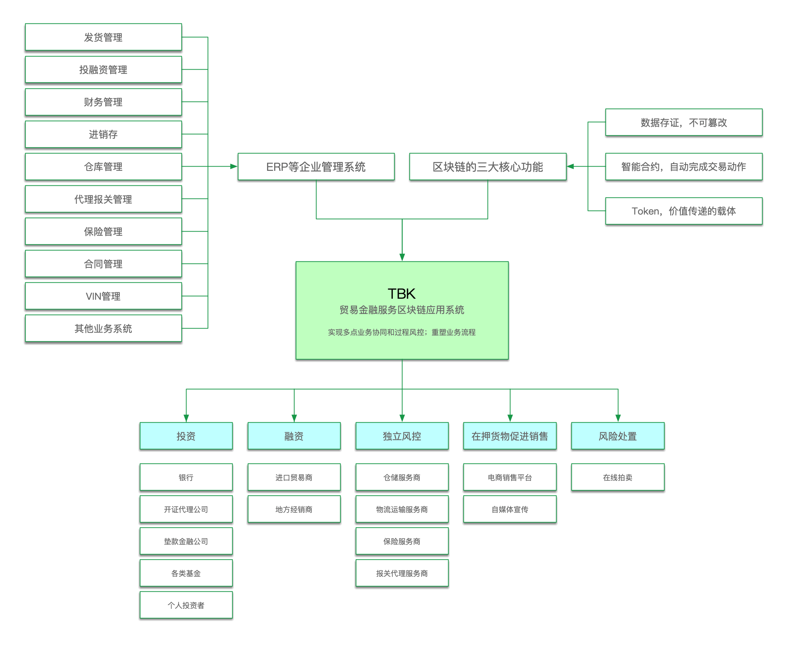
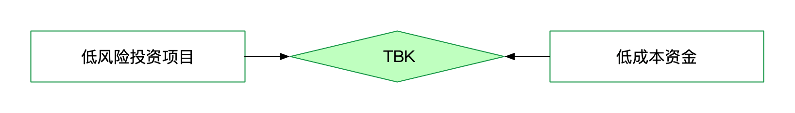
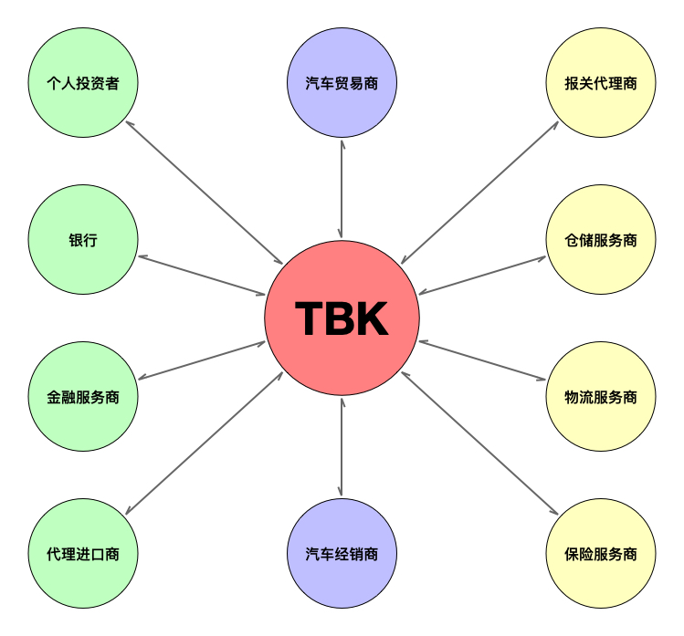
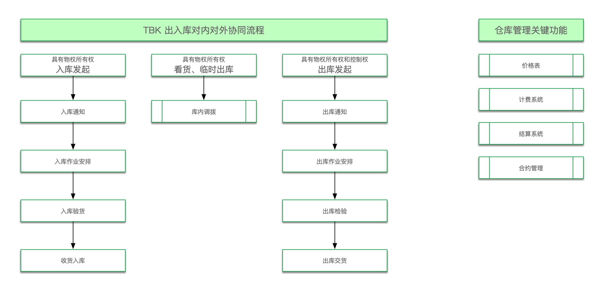
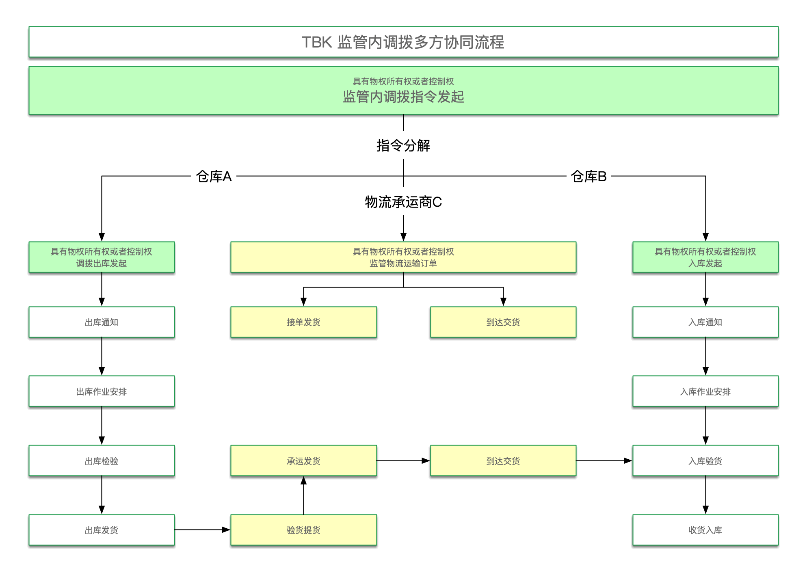
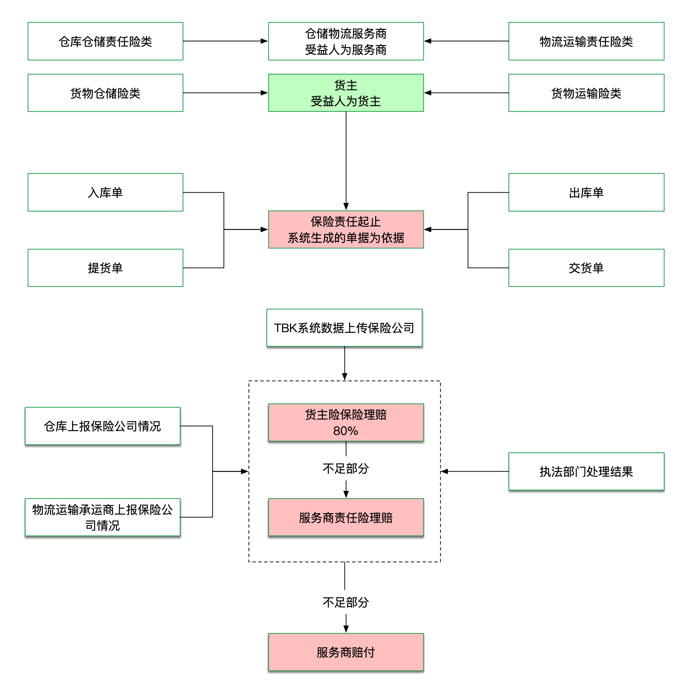
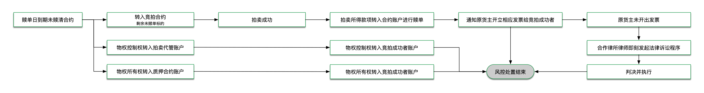

# 项目介绍

## 一、TBK是什么

**TBK，是运行在区块链上的开放式互联网金融服务平台。**通过区块链技术，保障信息与数据的一致性、可追溯性、公开透明性，从技术上避免了互联网金融平台的暗箱操作。平台自身无法隐蔽的进行自融。通过 TBK 的风控系统，实现融资项目的过程风控，大幅度降低融资项目的潜在风险。从而保障了投资者的利益。

### \#TBK 项目，由五大服务板块组成：

1. 投资者服务体系
2. 融资者服务体系
3. 独立的风控体系
4. 在押货物促进销售体系
5. 风险处置体系

### \#TBK 项目，融合了ERP技术与区块链技术，把企业与企业的信息化系统连接在了一起。实现了价值在企业间的安全可信传递。

AOS区块链应用系统，是TBK项目核心。AOS 系统通过把传统的ERP系统与区块链技术相结合，解决了数据在多节点之间传输的真实性、一致性无法保障的问题，实现了跨企业多节点业务协同。

## 二、TBK 的核心目标

### 寻找低风险投资项目，对接低成本资金，打造真正的普惠金融平台。

#### TBK 目前关注的项目领域主要为供应链金融项目、贸易链金融项目、不动产抵押项目。这些项目符合如下要求：

1. 中小企业的融资需求
2. 有完整物权可以抵押
3. 融资周期短
4. 抵押物容易保存、变现能力强

## 三、TBK的角色定位

1. TBK，不是金融服务商。而是为金融服务商提供一系列风险控制和处置的技术解决方案和产品。
2. TBK为个人投资者寻找低风险项目，同时帮助那些努力经营、守法经营的中小企业对接低成本资金。

## 四、TBK 汽车贸易金融服务业务流程展示

以汽车贸易金融服务项目为例，进一步说明 TBK 的运转逻辑。

#### \*\*为了帮助你更好的理解TBK项目的逻辑，需要对在TBK项目中的重新定义的概念说明如下：

1. 物权：在TBK系统中，物权是由所有权和控制权组成的，缺少任何一个都是不能对货物进行处置的。例如，不能发起出库操作。
2. 物权所有权：是指物权的所有者，通常说的货主。货主拥有物权的所有权。当销售、风险处置时，会触发所有权的转移。拥有所有权而没有控制权是不能提取和最终处置货物的。
3. 物权控制权：是指物权的临时拥有权力。通常指抵押场景下的物权限制。拥有物权控制权而没有所有权是不能提取并最终处置货物的。
4. 物权监管：是指第三方机构对货物进行控制的行为。这在本质上属于数字化仓单管理机制。物权监管人不会接收到来自非完整物权人的提货请求的。这保障了监管的物权清晰、交易的高效。
5. 位置：是指货物的在库在途状态。通常是指库位。表明了当前监管货物所在的位置，并对当前位置做出评估，确认是否符合合约的约定。
6. 自动拍卖：是一旦出现融资人违约，对抵押货物的唯一处置方式。通过公开的在线拍卖，迅速完成对违约抵押物的处置变现，保护投资人的合法权益。

### **1. TBK 现货质押业务全流程**

#### **此业务流**程是TBK的核心流程设计。在此模式中，金融服务商的价值判定和投资（出资）角色被拆分。

1. 在质押标的手续与价值判定环节，金融服务商的价值判定定位得以实现。
2. 在质押标的被价值判定后，进入投资竞买环节，在此环节，金融服务商的投资角色得以实现。

### 2. 开证、押汇、垫税业务主流程 

### 3. TBK 代理报关业务流程

### 4. TBK 仓储业务流程

\*\* 仓储服务商不需要再为繁琐的物权指令而头疼，TBK清晰的、可信任的物权管理合约让整个仓储监管服务流程大幅度简化，开启了新型监管服务的时代。

### 5. TBK 监管内调拨业务主流程

\*\* 由TBK独创的监管内调拨指令体系，依托于TBK的物权智能合约，让更大范围的监管内货物调拨移动成为了可能。在不间断的金融服务前提下，帮助货主把货物快速转移到销售终端，加快了货主货物的销售回款。

### 6. TBK 保险业务流程

1. 保险依据系统的单据信息自动发起投保程序，并依据系统记录的状态自动发起理赔流程。通过TBK系统的可信数据，最大限度的简化了投保和理赔的流程。
2. 一旦进入理赔流程则会自动由指定律师介入。

### 7. TBK 风险处置流程

1. 融资者合约到期未能履行赎单义务时，合约自动将未执行完毕的合约项下货物转入竞拍合约进行公开拍卖。
2. 拍卖所得款项自动转入融资合约账户清偿，一旦拍卖款项进入合约账户，则融资合约即刻结束并清算。
3. 由于商品流通中涉及到增值税发票的处理，因此，在拍卖结束后，系统会自动委托合约约定的律师即刻进入催要增值税发票流程。根据具体情形直到采取法律行动维护权益。
4. 税务发票开具之后，则标志着风险处置的最终结束。

