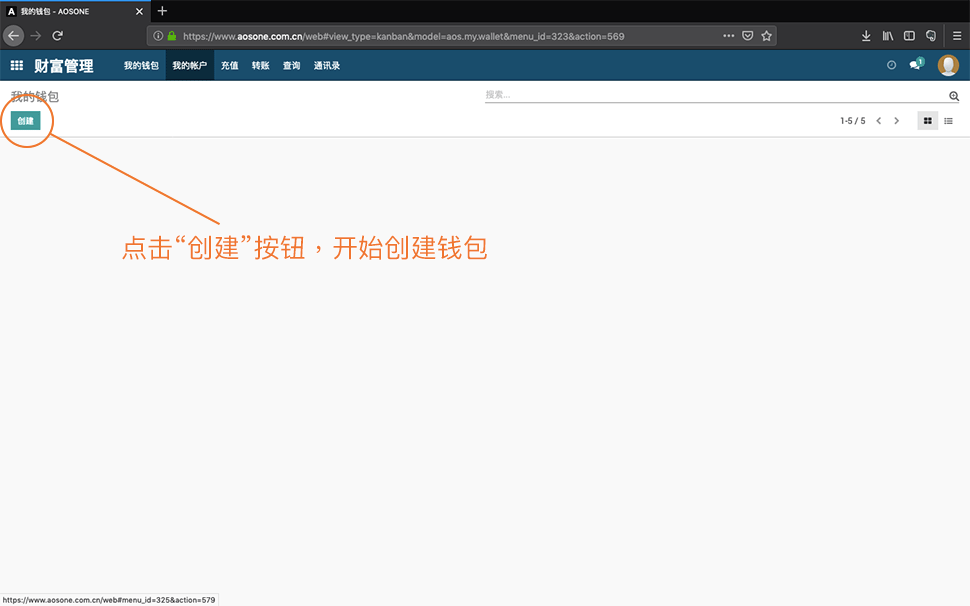

# 注册AOS区块链账号

1. 进入“财富管理”

2. 点击“创建”，开始创建钱包

3. 点击“付款”，进入支付页面

4. 使用微信“扫一扫”完成付款，单击“已付款”按钮

5. 点击“编辑”按钮，设置密码

6. 密码至少8位，数字与字母组合密码

7. 保存系统生成的“秘钥”

7-2. 确认已保存好“秘钥”后，点击“已存秘钥”按钮

8. 设置自己的12位账户名

9. 账户开通成功。

